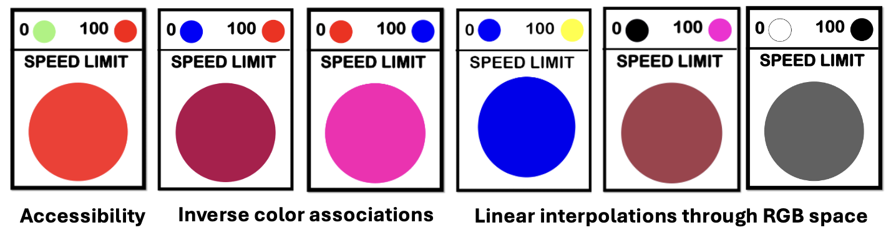

# 🚦 Seeing Speed: A Classroom Challenge in Color Mapping and Meaning
**Author:** [Evan Peck](https://evanpeck.github.io/), CU Boulder Information Science


**Goal:** In a 1-hour hands-on activity, students gain experience encountering important topics in color design, including…
- **Color spaces:** Linear interpolations in some non-uniformly perceptual color spaces (e.g RGB) are not interpreted as linear by people. 
- **Semantics:** Individual differences may disrupt the meanings we associate with colors
- **Accessibility:** Relying on intuition is likely to create inaccessible designs
- **Human-Centered Design Process:** User testing is highly effective at providing quick, cheap tests against our own intuition



---

## 🚦 Design Challenge and Activity Structure

  

**Scenario:**  
> The state of Colorado has proposed using variable speed limits to reduce highway traffic congestion. But there’s a catch: they don’t have the budget for numeric speed signs. Instead, they’re testing single-color LED signs to communicate speed, and you’ve been hired to design the mapping. Your job is to translate any speed-limit from 0 to 100 to a unique color that is immediately understandable by drivers.

**Structure:** This activity is run early in a course, before any lectures on color. It’s a chance for groups of students to test their assumptions through design, prototyping, and peer feedback.

1. _Design (~15 min):_ Determine how to map speed values to colors  
2. _Prototype (~10 min):_ Create 7 speed limit signs for random speeds between 0 and 100  
3. _Evaluation (~10 min):_ User test with 3 students, guessing speed limits based on signs  
4. _Share and Discuss (~15 min):_ Share results, compare designs, and discuss tradeoffs  

## 📁 Resources
- Instructional Slides \| [Google Slides](https://docs.google.com/presentation/d/19QA-7atf0yC54HC53tNWhTGCgMjhzG0SVibu872JnhE/edit?usp=sharing)
- Student Speed Limit Template \| [Google Slides](https://docs.google.com/presentation/d/1x7zeDq1cxHyKbqjtBV8I0gXu55fWQJgNwlzK7iVIntY/edit?usp=drive_link)
- Rapid User Testing Template [Google Sheets](https://docs.google.com/spreadsheets/d/1FicHNwU0godttYsi1z2xcAv_W5IB20_PtrBwHaSUc_U/edit?usp=sharing)

---

## 🧠 What Students Learn (and Often Misjudge)

#### Accessibility is easy to overlook

Red and green are common choices for traffic lights and visualizations, so students often default to a red-to-green color map. But this creates issues for users with red-green color blindness.

💡 **Learning opportunity:** Students see how easy it is to exclude users without realizing it.  
This sets up a rich discussion on accessible design — and why traffic lights avoid this problem (redundant encoding via position *and* color!).

#### Perceptual uniformity matters more than it seems

Students familiar with RGB often assume that linear interpolation across RGB space produces intuitive gradients. It doesn’t, and we can observe the fault lines together in their short user evaluation.

💡 **Learning opportunity:** This provides an opportunity to talk about the advantages and disadvantages of different color spaces (HSL, RGB, CIELab), and why perceptual uniformity is important for effective encoding.

#### Color semantics vary — sometimes dramatically

Each semester, some student groups choose red to represent an upper-limit (100 mph) and green (or blue) to represent a safer, lower-limit (0 mph). Other groups make the opposite association — red for “stop” (0 mph) and green (or blue) for “go” (100 mph).

💡 **Learning opportunity:** Students come to appreciate the ambiguity and subjectivity of color semantics, and how cultural or contextual meanings can conflict with even a perceptually-uniform color mapping.

#### Students learn the value of quick user testing

Student groups are often shocked to find that their intuitions (especially in color associations!) aren’t shared by other student groups. This mirrors a common misconception in design, where creators falsely extrapolate their own experiences to large groups of people.

💡 **Learning opportunity:**  Even for something as simple as designing a single light, students discover that just 10-minutes of feedback from classmates can have a dramatic, positive impact on the effectiveness of their design.



